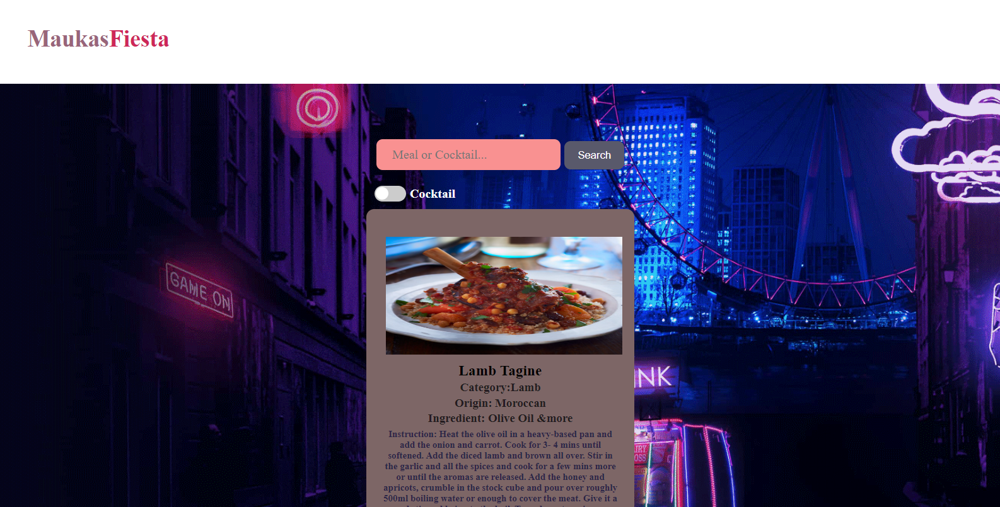
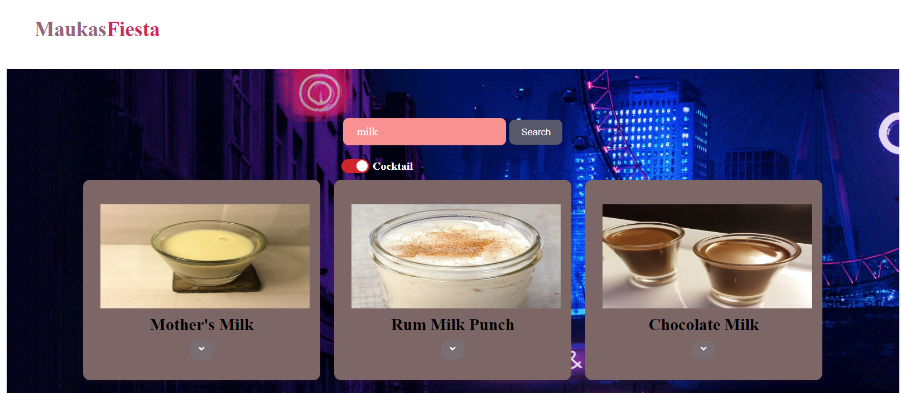
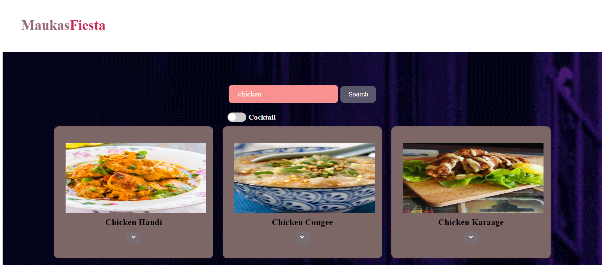

# Meal and Cocktail Search App using React JS
This is a simple React application that allows users to search for meals and cocktails by name. The application uses the TheMealDB and TheCocktailDB APIs to fetch data.

## Features
a. Search for meals or cocktails by name.
b. Toggle between meal and cocktail search.
c. View details of a meal or cocktail, including category, ingredients, and instructions.
d. Fetch and display a random meal or cocktail when the page loads.

## Event handlers:
handleSearch: Called when the user clicks the search button or presses Enter in the search input. Updates url to the search endpoint for meals or cocktails based on name and toggle.
handleInputChange: Updates name based on the search input.
handleToggle: Called when the user clicks the toggle switch. Updates toggle and url to the random endpoint for meals or cocktails.

## Custome Hook:
useFetchProducts Hook: The useFetchProducts hook is a custom hook that fetches data from the API.

How to Run
Clone the repository.
Install the dependencies with npm install.
Start the application with npm start.
Open http://localhost:3000 to view it in the browser.

Moreover it has been deployed on gitHub, you can check this out too.
http://AnisulMahmud.github.io/MaukasFiesta

